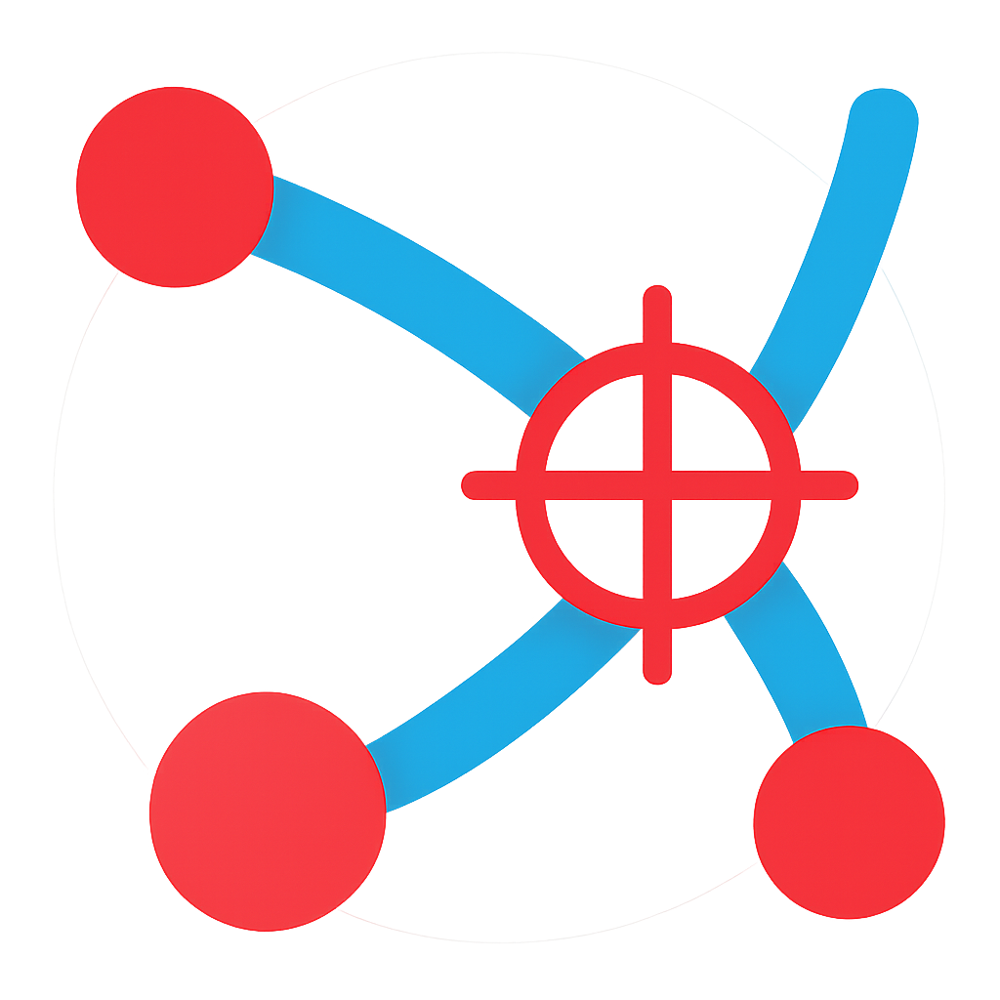

# Plot Digitizer

A powerful, modern web-based tool for extracting numerical data from plot images and PDFs. Built with React, Konva, and Tailwind CSS.



## Features

### 🎯 Core Digitization
- **Point Extraction**: Manually place points on data series to extract X/Y coordinates.
- **Smart Wand**: A guided tracing tool that automatically generates points along a path you drag.
- **Auto-Trace Wand**: Flood-fill based tracing to detect continuous lines of a specific color.
- **Points of Interest**: Place independent "POI pins" to annotate specific locations.
- **Selection & Manipulation**: Drag, select, and delete points. Use **Arrow Keys** to nudge selections (hold **Shift** for larger steps).

### 📐 Advanced Calibration
- **Multiple Axes**: Support for multiple Y-axes on the same plot.
- **Calibration Guides**: Visual crosshairs and snapping assist in aligning calibration points perfectly.
- **Log Scales**: Full support for Logarithmic scales on both X and Y axes.

### 🛠️ Professional Tools
- **Project Management**: 
  - **Tabbed Workspaces**: Work on multiple plots simultaneously.
  - **Save & Load**: Save your entire workspace state to a local JSON file.
- **Data Series**: Rename series and customize their colors.
- **Fit & Resample**: Fit curves (Linear, Polynomial, Exponential) to your data and resample points for even distribution.
- **PDF Support**: Import PDF files and select specific pages.
- **Clipboard Integration**: Paste images directly (Ctrl+V) and copy data tables to clipboard.

### 🎨 Visual & Export
- **Modern UI**: Polished interface with Dark Mode support.
- **Export Data**: Download as CSV or Copy to clipboard.
- **Export Graphics**: Save the annotated plot as an image, or use "Graphics Only" for a transparent overlay.

## Getting Started

### Prerequisites

- Node.js (v18+ recommended)
- npm or yarn

### Installation

1. Clone the repository
2. Install dependencies:
   ```bash
   npm install
   ```
3. Start the development server:
   ```bash
   npm run dev
   ```
4. Open the shown local URL (usually `http://localhost:5173`) in your browser.

## How to Use

### 1. Load Data
- Click the center dropzone to select an **Image** (PNG, JPG, SVG) or **PDF** file.
- Or, simply **Paste** an image from your clipboard (`Ctrl+V`).

### 2. Calibrate Axes
- **X Axis**: Click **Calibrate X**. Follow the visual guides to place two known points. Enter their values.
- **Y Axis**: Click **Calibrate Y**. Place two points and enter values. 
- *Toggle 'Log' if the axis uses a logarithmic scale.*

### 3. Digitize Data
- **Manual**: Use the **Digitize** tool to click points.
- **Smart Wand**: Use the **Smart Wand** to trace complex curves.
- **Wand**: Use the **Wand** to auto-select lines by color.
- **POI**: Use the **Point** tool for specific points of interest.
- **Refine**: Switch to **Select** mode to edit points.
- **Manage**: Rename series and change colors via the sidebar. Use "**Fit & Resample**" to smooth or decimate data.

### 4. Export
- **Data**: Use the Copy or Download buttons in the sidebar.
- **Visuals**: Use the Camera icon to save an image. Toggle "Image Off" icon for transparent graphics export.

## Deployment

The app supports deployment to root paths or subpaths (e.g., GitHub Pages).

- **Root Domain**:
  ```bash
  npm run build
  ```
- **Subpath** (e.g., `/my-app/`):
  ```bash
  BASE_URL=/my-app/ npm run build
  ```

### GitHub Pages

This project includes scripts for deploying the built site to GitHub Pages:

- Build and publish with one command:
  ```bash
  npm run deploy
  ```
  The `predeploy` script automatically runs the production build before publishing the `dist` directory.
- Build only (useful for verifying output before publishing):
  ```bash
  npm run build
  ```

## Tech Stack

- **Framework**: React 19 + Vite
- **Canvas**: Konva.js / React-Konva
- **Styling**: Tailwind CSS
- **State**: Zustand
- **PDF**: pdf.js
- **Icons**: Lucide React

## License

MIT
